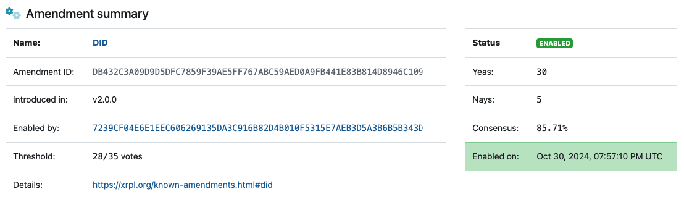
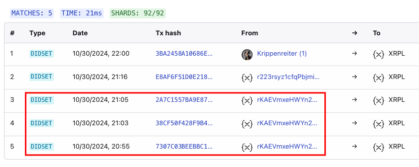

# DID on XRP Ledger Demo

This is a simple demo project showing how to create a Decentralized Identifier (DID) on the XRP Ledger. Following the [first amendment](https://xrpscan.com/amendment/DID) to the DID specification, this is the first implementation of DIDs on the XRP Ledger.

## What is a DID?

A DID (Decentralized Identifier) is a unique identifier that lets you control your own digital identity without relying on any central authority.

## Usage

This demo shows how to:

- Create a new XRP wallet
- Fund it with XRP (faucet)
- Set a DID document URL using the DIDSet transaction type

## Getting Started

1. Clone this repo
2. Run `pnpm i`
3. Update the DID_DOCUMENT_URL in index.js
4. Run `node index.js`

The script will:

- Create or load a wallet
- Fund it if needed
- Set your DID document URL on the XRP Ledger

## First DID on XRP Ledger

[Proud to be the first!](https://xrpscan.com/tx/38CF50F428F9B4FD702DD10378257B2730A5FD525387D7462346248294F37942)

Special thanks to:

- [XRPL Commons](https://www.xrpl-commons.org/) for their support and resources
- [Yue (cduchinois)](https://github.com/cduchinois) co-founder of [Cr3dential](https://cr3dential.com/)

## Tips

If you're having trouble:

- Make sure you have enough XRP in your wallet (at least 20 XRP for reserve requirements)
- For testing, use the XRPL Devnet instead of Mainnet by changing the client URL to: `wss://s.devnet.rippletest.net:51233/`
- Check that your DID document URL is accessible and follows the proper format
- Verify your wallet was created/loaded successfully by checking the console output
- If transactions fail, ensure you're connected to a healthy XRPL node

For more help, check out:

- [XRPL DID Documentation](https://xrpl.org/docs/references/protocol/transactions/types/didset#didset)
- [XRPL Amendments](https://xrpscan.com/amendment/DID)
- [XRPL Devnet Faucet](https://xrpl.org/xrp-testnet-faucet.html)

## Donations

If you find this repo helpful, consider sending a donation to support development:

XRP Address: rP5poaoykbEaxwW197i8bbtQUWgdBGtmxy

Even small donations make a difference! Thank you for supporting open source development.
